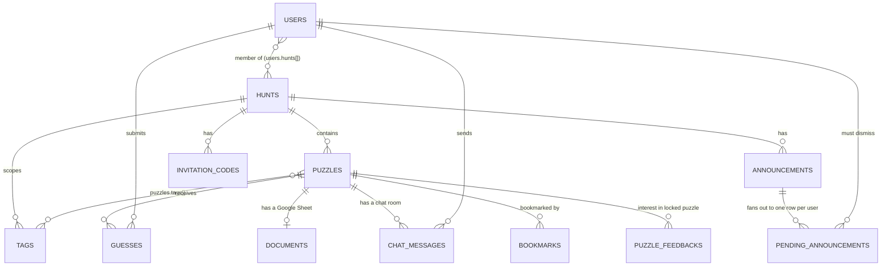

---
files:
  - imports/lib/models/Model.ts
  - imports/lib/models/SoftDeletedModel.ts
  - imports/lib/models/customTypes.ts
  - imports/lib/models/generateJsonSchema.ts
  - imports/lib/models/validateSchema.ts
  - imports/lib/models/withCommon.ts
  - imports/lib/models/facade.ts
  - imports/server/schemas.ts
  - imports/server/indexes.ts
updated: 2026-09-19
---

# 05 — The data layer

Jolly Roger stores everything in MongoDB, but you will almost never touch
`Mongo.Collection` directly. There is a wrapper, `Model`, and it does enough that you have to
understand it before you can safely write a query.

## 1. What you need to know about MongoDB first

If you have only used relational databases: MongoDB stores JSON-like **documents** in
**collections** (tables). Documents in a collection do not have to share a shape. There are no
joins and no foreign key constraints; a "foreign key" here is just a string field that happens
to hold another document's `_id`, and **nothing enforces that it points at anything**.

Updates use **modifier** syntax rather than assignment:

```js
collection.update({ _id: id }, { $set: { title: "New" }, $push: { tags: tagId } })
```

That distinction between a *document* and a *modifier* matters a lot below, because the schema
layer has to validate both, and they have different shapes.

MongoDB can enforce a per-collection JSON Schema (`$jsonSchema`) and reject writes that violate
it. Jolly Roger uses this, and generates the schema automatically.

## 2. The three layers of validation

This is the part that surprises people. A write is checked **three** times, in three different
places, for three different reasons:

| Layer | Where | Catches |
| --- | --- | --- |
| **TypeScript** | Compile time | Wrong shape in code you wrote. No runtime effect at all; Meteor only strips types. |
| **zod** | In `Model.insertAsync` / `updateAsync`, before the write | Wrong runtime values; also **applies defaults and transforms** (timestamps, uppercasing answers) |
| **MongoDB `$jsonSchema`** | In the database | Anything that got past the first two, including writes from a `mongo` shell or a bypassed model |

The zod schema is the single source of truth. The TypeScript type is *derived* from it with
`z.infer`, and the MongoDB validator is *generated* from it by
`imports/lib/models/generateJsonSchema.ts`. You write the schema once.

## 3. Declaring a collection

Here is a real one, `imports/lib/models/Puzzles.ts`, with the boilerplate intact:

```ts
import { z } from "zod";
import { answer, foreignKey, nonEmptyString } from "./customTypes";
import type { ModelType } from "./Model";
import SoftDeletedModel from "./SoftDeletedModel";
import withCommon from "./withCommon";

const Puzzle = withCommon(
  z.object({
    hunt: foreignKey,
    tags: tagList,
    title: nonEmptyString,
    url: z.string().url().optional(),
    answers: answer.array(),
    expectedAnswerCount: z.number().int().min(-1),
    markedComplete: z.boolean().optional(),
    // ...
  }),
);

const Puzzles = new SoftDeletedModel("jr_puzzles", Puzzle);
Puzzles.addIndex({ deleted: 1, hunt: 1 });
Puzzles.addIndex({ url: 1 });
export type PuzzleType = ModelType<typeof Puzzles>;

export default Puzzles;
```

Five things are happening:

1. **`z.object({...})`** is the schema. It is the only definition of the shape.
2. **`withCommon(...)`** mixes in four fields every domain collection has (section 5).
3. **`new SoftDeletedModel("jr_puzzles", Puzzle)`** creates the collection. The `jr_` prefix is
   the house convention. The constructor also adds `_id`, generates the relaxed modifier schema,
   validates the schema itself, and **registers the model in a global `AllModels` set**.
4. **`addIndex(...)`** *declares* an index. It does not create one; `imports/server/indexes.ts`
   reconciles declarations against the live database at startup.
5. **`ModelType<typeof Puzzles>`** extracts the TypeScript type. Always derive the type; never
   hand-write a parallel interface.

> **Foot-gun: a model nobody imports is invisible to startup.**
> `AllModels` registration happens in the constructor, so a model module that is never imported
> is never constructed, never registered, and therefore gets **no `$jsonSchema` validator and
> none of its declared indexes**. It will still function and will silently accept garbage.
> This is why `imports/lib/models/facade.ts` imports every model and `server/main.ts` imports
> the facade.

## 4. The `Model` class

`imports/lib/models/Model.ts` wraps `Mongo.Collection`. The API you will use:

| Method | Notes |
| --- | --- |
| `insertAsync(doc)` | Parses `doc` through the zod schema first, applying defaults and transforms |
| `updateAsync(selector, modifier, opts)` | Parses the **modifier** through a relaxed schema (section 4.1) |
| `upsertAsync(selector, modifier, opts)` | Same |
| `removeAsync(selector)` | A real delete. Usually you want `destroyAsync` instead (section 6). |
| `find(selector, opts)` | Returns a cursor. Synchronous; safe on both sides. |
| `findOne(selector, opts)` | **Client only.** Banned on the server by the ESLint rule. |
| `findOneAsync(selector, opts)` | The server version. |
| `addIndex(spec, opts)` | Declares an index |

Note the deliberate asymmetry: **all mutations are async-only**, but `find` has both forms,
because a Tracker computation on the client must be synchronous.

Both `insertAsync` and `updateAsync` accept `{ bypassSchema: true }` as an escape hatch for
migrations that need to write shapes the current schema rejects. Use it only there.

### 4.1 Why modifiers need a "relaxed" schema

This is the cleverest and most confusing machinery in the repo, so it is worth understanding
rather than working around.

A document schema says `title` is a required non-empty string. But
`{ $set: { title: "x" } }` is a *partial* update: it sets `title` and says nothing about the
other required fields. Validating a modifier against the document schema would reject every
legal update.

So `relaxSchema()` walks the zod schema and transforms it: every field becomes optional, array
constraints loosen (because `$push` can target an element, an array, or `{ $each: [...] }`), and
crucially, **defaults become conditional transforms** that only fire on inserts and upserts.

That last bit uses `Meteor.EnvironmentVariable` as dynamic scope. `IsInsert`, `IsUpdate` and
`IsUpsert` (in `customTypes.ts`) are set around the parse, and a field like `createdAt` checks
them to decide whether to supply a default:

```ts
// Model.ts, inside relaxSchema's ZodDefault case
if (IsInsert.getOrNullIfOutsideFiber() || IsUpsert.getOrNullIfOutsideFiber()) {
  return defaultValue();
}
return undefined;
```

This is how `createdAt` gets set on insert but is never clobbered on update, while `updatedAt`
gets set on both. If you add a field with a default and it behaves oddly, this is where to look.

`parseMongoModifierAsync` then handles the rest: splitting dot-separated paths
(`"noteContent.summary"`) and recursing, handling each operator, and de-conflicting
`$setOnInsert` against the other operators.

## 5. The common field mixins

Three helpers in `imports/lib/models/`:

- `withTimestamps` adds `createdAt` and `updatedAt`.
- `withUsers` adds `createdBy` and `updatedBy` (user IDs).
- `withCommon` adds all four at once, and is what almost every domain collection uses.

They are not just field lists. `createdTimestamp` and `createdUser` are zod types with transforms
that populate themselves from the current Meteor invocation, which is why you never write
`createdAt: new Date()` by hand. They also throw at construction time if the schema already has
those fields, so you cannot double-apply them.

## 6. Soft deletion

Most domain collections extend `SoftDeletedModel` rather than `Model`. It adds a `deleted`
boolean and **rewrites your queries**:

| Method | Actually queries |
| --- | --- |
| `find(...)` / `findOne(...)` / `findOneAsync(...)` | `{ ...yours, deleted: false }` |
| `findDeleted(...)` etc. | `{ ...yours, deleted: true }` |
| `findAllowingDeleted(...)` etc. | Your selector, unmodified |
| `destroyAsync(selector)` | `$set: { deleted: true }` on all matches |
| `undestroyAsync(selector)` | The reverse |

So a plain `Puzzles.find({ hunt: huntId })` already excludes deleted puzzles. You get this for
free and usually want it.

> **Foot-gun: `removeAsync` is a real delete and bypasses the soft-delete convention.**
> `destroyAsync` is almost always what you mean. `removeAsync` exists for collections where
> genuine deletion is correct, such as notification outbox rows.

> **Foot-gun: soft deletion silently adds `deleted` to your projection.**
> If you pass a projection, `SoftDeletedModel` injects `deleted: 1` into it, because it needs
> that field. Do not be surprised to see it in results you did not ask for.

## 7. The custom type vocabulary

`imports/lib/models/customTypes.ts` defines the zod vocabulary this repo uses instead of raw zod
primitives. Learn these; using bare `z.string()` will usually be rejected.

| Type | Meaning |
| --- | --- |
| `nonEmptyString` | A string that must not be empty. The default choice for text. |
| `allowedEmptyString` | The explicit escape hatch when empty really is valid |
| `foreignKey` | A 17-character Meteor ID. **A regex, not a constraint** — nothing checks the target exists. |
| `answer` | A string, uppercased by a transform on write |
| `snowflake` | A Discord ID |
| `stringId` | The default `_id` type |
| `deleted` | The soft-delete flag |
| `createdTimestamp`, `updatedTimestamp`, `createdUser`, `updatedUser` | Self-populating audit fields |
| `IsInsert`, `IsUpdate`, `IsUpsert` | Not types: `Meteor.EnvironmentVariable`s used as dynamic scope by `relaxSchema` |

`imports/lib/models/validateSchema.ts` runs at `Model` construction time and **rejects zod
constructs the generator cannot handle**, including a bare `z.string()` that could be empty. So
the set of legal schemas is smaller than all of zod. If your model throws at startup, read that
file.

## 8. The collection catalogue

Around 50 application collections. Grouped by what they are for.

### Core hunt domain

| Collection | Mongo name | Purpose |
| --- | --- | --- |
| `Hunts` | `jr_hunts` | One running of a puzzlehunt. The tenancy root; almost everything hangs off it. |
| `Puzzles` | `jr_puzzles` | One puzzle. Holds `answers[]`, `expectedAnswerCount` (`-1` means unknown), `tags[]`, notes. |
| `Tags` | `jr_tags` | A hunt-scoped label. The **only** grouping mechanism. |
| `Guesses` | `jr_guesses` | A proposed answer plus its review state, `direction` and `confidence`. |
| `Documents` | `jr_documents` | The Google Sheet or Doc attached to a puzzle. |
| `ChatMessages` | `jr_chatmessages` | One chat message. `content` is a rich-text node tree, not a string. A missing `sender` means a system message. |
| `Bookmarks` | `jr_bookmarks` | "Watch this puzzle" for one user. |
| `PuzzleFeedbacks` | `jr_puzzle_feedbacks` | **Misnamed**: interest registration for a *locked* puzzle. |
| `Announcements` / `PendingAnnouncements` | `jr_announcements`, `jr_pending_announcements` | A broadcast, and one undismissed row per recipient. |
| `InvitationCodes` | `jr_invitation_codes` | A shareable code granting hunt membership. |
| `Meteor.users` | `users` | Accounts, hunt membership, roles, dingwords. See section 9. |

### Notifications

Three "outbox" collections. A hook inserts one row per recipient; the client subscribes to its
own rows and deletes them on dismissal.

`ChatNotifications` (mention or dingword hit), `PuzzleNotifications` (toast about a puzzle
event), `BookmarkNotifications` (a puzzle you bookmarked was solved).

### Configuration

`Settings` (`jr_settings`) is a singleton-per-`name` store, modeled as a **zod discriminated
union keyed on `name`**, covering Google Drive credentials and templates, the Discord bot and
guild, email branding, team name, the Google Script URL, the S3 bucket and general server
settings. `FeatureFlags` are circuit breakers where an absent record means off.
`BlobMappings` plus `Blobs` implement content-addressed branding assets.

### Integrations

Google Drive contributes `HuntFolders`, `FolderPermissions`, `DocumentActivities`,
`DriveActivityLatests` and `CachedDocuments` (the pre-created document pool). Discord
contributes `DiscordCache` (note: collection name `discord_cache`, **no `jr_` prefix**) and
`DiscordRoleGrants`.

### Presence and activity

`Subscribers` (one row per live subscription, powering "N people are viewing this puzzle"),
`UserStatuses`, `CallActivities`, `APIKeys`.

> **Foot-gun: there are two `CallActivities`.**
> `imports/server/models/CallActivities.ts` (`jr_call_activities`) is the live one.
> `imports/lib/models/CallActivities.ts` (`callActivities`, a raw collection) is an orphaned
> duplicate that is read but never written.

### Infrastructure

`Servers` (a heartbeat row per process; rows older than 120 seconds are treated as dead),
`Locks` (a cooperative distributed mutex), `LatestDeploymentTimestamps` (a singleton gating
startup work during rolling deploys). See [10-operations.md](10-operations.md).

### mediasoup

Sixteen collections under `imports/lib/models/mediasoup/` mirroring the WebRTC object graph:
`Rooms`, `Routers`, `Peers`, `Transports`, `ProducerClients`, `ProducerServers`, `Consumers`,
and the various request/ack pairs. **Throughout this group, a field named `call` holds a
Puzzle `_id`.** Explained in [09-integrations.md](09-integrations.md).

## 9. `Meteor.users` is the exception to everything

The users collection is provided by Meteor's accounts system, not by `Model`. So:

- It is not in `AllModels`, so it gets **no `$jsonSchema` validator** and its indexes are **not**
  reconciled by `imports/server/indexes.ts`. An index on `users` needs a migration.
- `imports/lib/models/MeteorUsers.ts` re-exports it wrapped for convenience, and
  `imports/lib/models/User.ts` holds the zod schema describing its shape, but that schema is
  documentation and client-side typing, not database-enforced validation.

The important fields: `hunts[]` (hunt membership), `roles` (a map of scope to role array, where
the scope is either a hunt ID or `GLOBAL_SCOPE`), `displayName`, `dingwords[]`, `googleAccount`,
`discordAccount`, `huntTermsAcceptedAt`.

## 10. Entity relationships



Read `Hunts` as the tenancy root: nearly every query in the application is scoped by hunt, and
nearly every permission check asks "is this user a member of, or an operator for, this hunt?"

Note that `Guesses.hunt` is **denormalized** — it is derivable from `Guesses.puzzle`, but is
stored so the guess queue can be published per hunt without a join.

## 11. Migrations

Migrations live in `imports/server/migrations/`, named `<number>-<kebab-description>.ts`, and
are currently numbered to 53.

```ts
// imports/server/migrations/<N>-your-change.ts
Migrations.add({
  version: N,
  name: "Human-readable description",
  async up() {
    // ...
  },
});
```

Then add `import "./<N>-your-change";` to `imports/server/migrations/all.ts`, or it never runs.

Rules:

- **Never edit a migration that has shipped.** It has already run in production; editing it
  changes nothing there and desynchronizes environments. Add a new one.
- **Do not write a migration to add an index on a `Model` collection.** Declare it with
  `addIndex` in the model file instead. `imports/server/indexes.ts` reconciles, and *will drop
  indexes it does not know about* — so an index created by a migration gets removed at the next
  startup. Indexes on `Meteor.users` are the exception and do need a migration.
- Migrations run at startup, under a lock so that only one process in the cluster runs them, and
  only on the newest deployed build. See [10-operations.md](10-operations.md).

Reading the existing migrations is a good way to learn the system's history: `38` and `39`
folded a separate `Profiles` collection into `users`, `50` upconverted plain-text chat messages
into the structured node format, `20` and `21` introduced multiple answers per puzzle.
