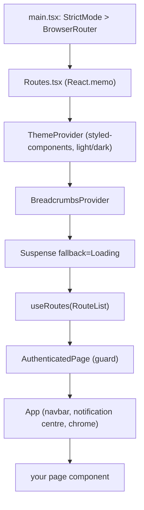
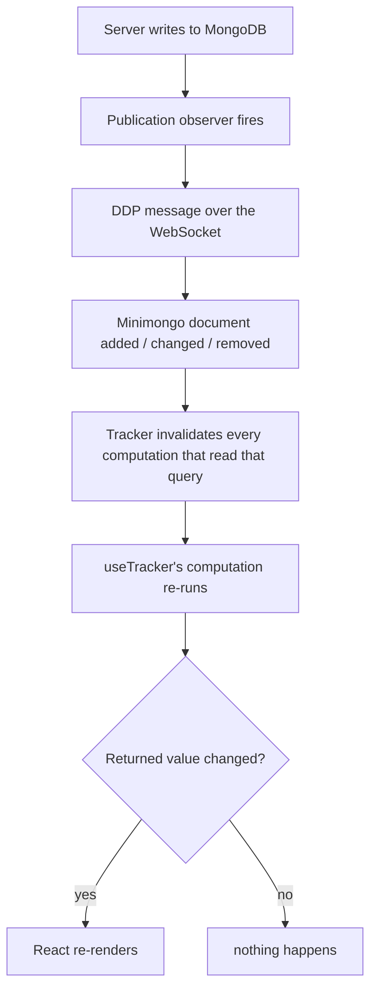

---
files:
  - imports/client/main.tsx
  - imports/client/components/Routes.tsx
  - imports/client/components/App.tsx
  - imports/client/components/PuzzlePage.tsx
  - imports/client/components/PuzzleListPage.tsx
  - imports/client/hooks/useTypedSubscribe.ts
  - imports/client/hooks/breadcrumb.tsx
  - imports/client/theme.ts
  - biome.jsonc
updated: 2026-09-19
---

# 07 — The client

A React 18 single-page app. About 90 components, flat, in `imports/client/components/`.
Routing is react-router v6. Styling is Bootstrap 5 plus styled-components. Data comes from
Minimongo via `react-meteor-data`, never from `fetch`.

## 1. Boot sequence

`client/main.ts` is a list of side-effect imports: error reporting first, then a polyfill, then
the shared accounts config, then `imports/client/main.tsx`, which mounts React.

The component tree above your page:



`client/main.ts` also defines `window.loadFacades()`, the browser-console debugging entry point
described in [02-getting-started.md](02-getting-started.md#6-debugging-tools-worth-knowing-on-day-one).

## 2. Routing

`imports/client/components/Routes.tsx` builds three arrays and feeds them to react-router's
`useRoutes`. The notable trick is that the auth guard is applied with `.map()` rather than
written per route:

```tsx
export const AuthenticatedRouteList: RouteObject[] = [
  { path: "/hunts", element: <HuntListApp />, children: [ /* ... */ ] },
  { path: "/users", element: <UsersApp />, children: [ /* ... */ ] },
  { path: "/setup", element: <SetupPage /> },
  { path: "/rtcdebug", element: <RTCDebugPage /> },
].map((r) => ({ ...r, element: <AuthenticatedPage>{r.element}</AuthenticatedPage> }));
```

Three consequences:

1. **Add a route to `AuthenticatedRouteList` and you get the guard and the full app chrome for
   free.** Add it to `RouteList` directly and you get neither, and must handle both logged-in and
   logged-out users yourself. `/join/:invitationCode` is the one route that does this deliberately.
2. The guard wraps only the parent element; nested children inherit it through `<Outlet />`.
3. **Both lists are exported for the test suite.** `tests/acceptance/smoke.tsx` imports them,
   flattens the nested paths, substitutes fixture values for `:huntId`, `:puzzleId` and friends,
   and navigates to each one. **Adding a route automatically adds a smoke test.**

### The route table

| Path | Component | Guard | Notes |
| --- | --- | --- | --- |
| `/` | `RootRedirector` | — | Three-way redirect depending on login and hunt membership |
| `/hunts` | `HuntListApp` → `HuntListPage` | Auth | |
| `/hunts/new` | `HuntEditPage` | Auth | Lazy |
| `/hunts/:huntId` | `HuntApp` | Auth | Gatekeeper: membership, deletion, terms of use |
| `/hunts/:huntId/puzzles` | `PuzzleListPage` | Auth | The main screen |
| `/hunts/:huntId/puzzles/:puzzleId` | `PuzzlePage` | Auth | The big one. Chat plus document, in a split pane |
| `/hunts/:huntId/announcements` | `AnnouncementsPage` | Auth | |
| `/hunts/:huntId/firehose` | `FirehosePage` | Auth | Every chat message in the hunt, one stream |
| `/hunts/:huntId/guesses` | `GuessQueuePage` | Auth | The operator queue |
| `/hunts/:huntId/hunters` | `HuntersApp` → `HuntProfileListPage` | Auth | |
| `/hunts/:huntId/hunters/invite` | `UserInvitePage` | Auth | |
| `/hunts/:huntId/hunters/:userId` | `ProfilePage` | Auth | Shared with `/users/:userId` |
| `/hunts/:huntId/edit` | `HuntEditPage` | Auth | Lazy |
| `/hunts/:huntId/more` | `MoreAppPage` | Auth | Hosts the bookmarklet |
| `/hunts/:huntId/tags` | `TagBulkEditPage` | Auth | |
| `/hunts/:huntId/notes` | `NotesPage` | Auth | |
| `/hunts/:huntId/purge` | `HuntPurgePage` | Auth | Destructive admin operations |
| `/hunts/:huntId/custom-link` | `CustomLinkEmbedPage` | Auth | Renders an iframe |
| `/users`, `/users/:userId` | `UsersApp`, `ProfilePage` | Auth | `userId === "me"` redirects to your own |
| `/setup` | `SetupPage` | Auth | Lazy. ~2600 lines of admin configuration |
| `/rtcdebug` | `RTCDebugPage` | Auth | Lazy. mediasoup internals |
| `/login`, `/forgot-password`, `/reset-password/:token`, `/enroll/:token`, `/create-first-user` | Account forms | Unauth | Splash chrome |
| `/join/:invitationCode` | `JoinHunt` | — | Handles both auth states itself |

> **Gap worth knowing: there is no catch-all route.**
> `Routes.tsx` has no `path: "*"` and there is no 404 component. `useRoutes` returns `null` for
> an unmatched URL, so a mistyped URL renders a completely blank page with no navbar.

## 3. How components get data

The standard shape, which you will write dozens of times:

```tsx
const MyPage = () => {
  const huntId = useParams<{ huntId: string }>().huntId!;

  // 1. Open a subscription. Returns a FUNCTION, not a boolean.
  const loading = useTypedSubscribe(puzzlesForHunt, { huntId });

  // 2. Query Minimongo reactively. Note the dependency array.
  const puzzles = useTracker(
    () => Puzzles.find({ hunt: huntId }, { sort: { title: 1 } }).fetch(),
    [huntId],
  );

  // 3. Render a loading state while the subscription catches up.
  if (loading()) return <Loading />;
  return <PuzzleList puzzles={puzzles} />;
};
```

Points that catch people out:

- `loading()` is a **call**. Forgetting the parentheses gives a permanently truthy value and a
  component stuck on the loading state.
- `useTypedSubscribe(pub, undefined)` is the idiom for **not subscribing yet**. You cannot call
  hooks conditionally, so this is how conditional subscriptions are expressed.
- Subscriptions are **reference counted**. Two components subscribing to the same publication
  with the same arguments share one DDP subscription, and it stops when the last unmounts.
- `useTracker` reads Minimongo **synchronously**. No `await`. The async rules from
  [03-meteor-primer.md](03-meteor-primer.md#6-meteor-3-and-the-async-rule) do not apply in
  `imports/client/`, and the ESLint rule that enforces them is switched off there.

### Pseudo-collections

Some client state is a `Mongo.Collection` on the browser side with **no corresponding MongoDB
collection on the server**. The server pushes rows into it from inside a publication with
`this.added("collectionName", id, fields)`.

`imports/client/HasUsers.ts` is four lines and is the smallest example: it exists so the login
page can know whether any user account exists yet, which decides between showing a login form
and showing the first-user form. `imports/server/setup.ts` pushes the single row.

There are half a dozen of these in `imports/client/`. They are confusing the first time because
you will grep for the collection name and find no model file.

> **Foot-gun: the collection name is a bare string on both sides.** A typo produces silence, not
> an error. Prefer a shared constant.

## 4. Reactivity and performance

Reactivity flows like this:



### The dependency array is enforced

Biome is configured to treat `useTracker` as a hook with a closure and a dependency array, so
`useExhaustiveDependencies` applies to it exactly as it does to `useMemo`:

```jsonc
// biome.jsonc
"useExhaustiveDependencies": {
  "level": "error",
  "options": { "hooks": [{ "name": "useTracker", "closureIndex": 0, "dependenciesIndex": 1 }] }
}
```

**Omitting a dependency is a CI error, not a warning.** And the consequence at runtime is worse
than a missed render: `useTracker(fn, deps)` memoizes the *computation* on `deps`, so the closure
captures values from the render in which `deps` last changed. An omitted dependency gives you a
**stale closure reading stale data forever**.

When a dependency is deliberately omitted, the house style is a suppression comment naming the
specific dependency and why:

```ts
// biome-ignore lint/correctness/useExhaustiveDependencies(huntId): We want to reset if the user navigates to a new puzzle
```

The no-deps form `useTracker(fn)` recreates the computation every render: always fresh, never
stale, more work. Roughly 10 of the ~194 `useTracker` call sites use it.

### The traps

- **One large `useTracker` returning a fresh object.** If the callback returns a new object
  literal, the comparison after re-running always says "changed", so the component re-renders on
  every unrelated document change in any query it touched. Split into several narrow
  `useTracker` calls that return primitives or stable references.
- **Expensive work inside the callback.** Fetching 250 puzzles and grouping them inside
  `useTracker` re-runs the entire grouping every time any one puzzle changes. The puzzle list
  keeps the reactive fetch and the expensive grouping in separate memos for exactly this reason.
- **Over-broad subscriptions.** The cost of a document is paid on every client, forever, in
  memory and in re-render churn. Project away fields you do not render.

## 5. Styling

Four layers, used in a strict hierarchy. Getting this right is the most useful single thing to
learn about the UI code.

1. **react-bootstrap components first.** Buttons, modals, popovers, tooltips, toasts, tabs, form
   controls, dropdowns and the navbar are all react-bootstrap. You will almost never hand-roll
   these.
2. **Bootstrap utility classes for small spacing tweaks**, via `className="me-2 py-0 d-flex"`.
3. **styled-components for anything bespoke** — layout, color, hover states, responsive
   behavior. This is the overwhelming majority of the CSS; 63 files import `styled-components`.
4. **Inline `style={{}}` only for values computed per render**, such as pixel positions from
   `getBoundingClientRect()` or a per-user avatar color.

Global SCSS (`client/stylesheets/`) is **only** for Bootstrap configuration and font loading. Do
not add application CSS there.

### styled-components in one minute

If you have not used it: it is CSS-in-JS via tagged template literals. You define a component
whose styles are written as real CSS, and it generates a unique class name:

```tsx
const Jumbotron = styled.div`
  padding-top: 2rem;
  background-color: ${({ theme }) => theme.colors.jumbotronBackground};
  border-radius: 0.3rem;
`;
```

Interpolated functions receive the component's props, plus `theme` from the nearest
`ThemeProvider`. You can also wrap an existing component: ``styled(BSImage)`max-width: 50%;` ``.

`.swcrc` enables `@swc/plugin-styled-components` with `displayName: true`, which is why generated
class names carry readable component names in devtools. If you remove that, debugging gets much
harder.

Theming lives in `imports/client/theme.ts` and supports light and dark. Consume it through the
`theme` prop in an interpolation, not by importing the theme object directly.

## 6. Two custom chrome systems

Both are hand-rolled and non-obvious.

**Breadcrumbs** (`imports/client/hooks/breadcrumb.tsx`). A page registers its crumb with a hook;
a context provider collects them from the nested route tree and the navbar renders the trail.
Crumbs can be dynamic (a hunt's name, a puzzle's title), which is why they are pushed by the
page rather than declared in the route table.

**Document title** (`useDocumentTitle`). Same idea for `<title>`.

## 7. Blocking hot code push

`imports/client/hooks/useBlockUpdate.tsx` hooks Meteor's private `Reload._onMigrate` to *defer* a
client reload while the user is mid-sentence, and surfaces the deferral in the notification
centre. This exists because a deploy during a hunt would otherwise discard a half-typed message.

## 8. Guided tour: `PuzzlePage.tsx`

At roughly 4,300 lines this is the largest component in the repo, the page users spend the most
time on, and the one you are most likely to be asked to change. Its structure:

- **A resizable split pane** (`SplitPaneMinus`, hand-rolled) dividing the embedded Google
  document from the chat and people rail.
- **The document pane** — an iframe to the puzzle's Google Sheet, or a placeholder when Google
  is not configured.
- **The chat pane** — the message list, the Slate-based composer (`FancyEditor`), and the people
  rail showing who is present and who is in the audio call.
- **The metadata bar** — title, URL, tags, answers, the guess form, and the notes editor.
- **The call section** — WebRTC audio, if enabled.

It opens a number of subscriptions: the puzzle itself plus related puzzles, chat messages,
presence, call state, and document metadata. Several of them are conditional, expressed by
passing `undefined` to `useTypedSubscribe`.

If you are changing this file, read [08-puzzle-logic.md](08-puzzle-logic.md) first for the tag
and solvedness semantics, and the chat section of
[09-integrations.md](09-integrations.md) for the message content model.

## 9. Component conventions

- One component per file, `PascalCase.tsx`, default export, flat in `components/`.
- Hooks in `imports/client/hooks/`, `useThing.ts`, `.tsx` only if they contain JSX.
- Shared styled-component primitives in `components/styling/` (note: `.tsx` even without JSX).
- Props typed inline or with a local `interface`; no shared props barrel.
- Biome restricts imports of `react-bootstrap` and `@fortawesome/free-solid-svg-icons` to deep
  paths (`react-bootstrap/Button`, not `{ Button } from "react-bootstrap"`) for bundle size. CI
  enforces it.
