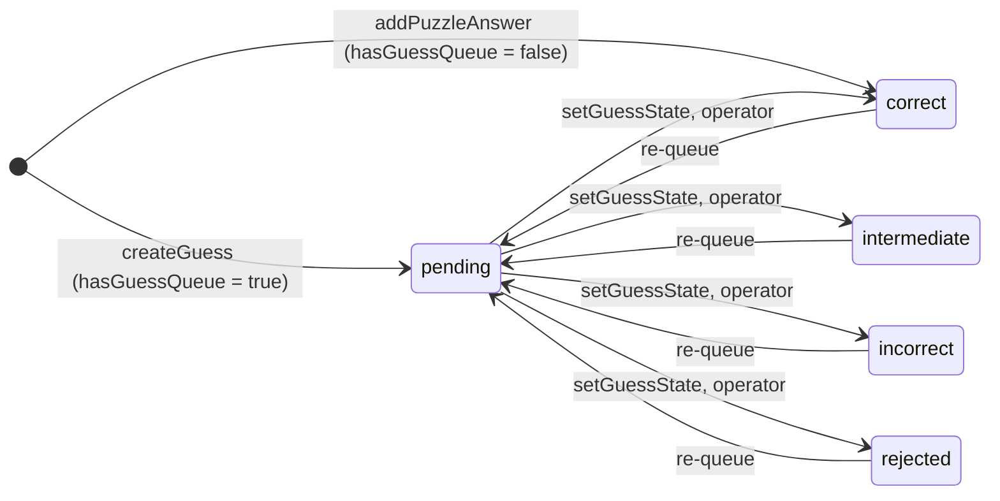

---
files:
  - imports/lib/puzzle-sort-and-group.ts
  - imports/lib/solvedness.ts
  - imports/lib/models/Puzzles.ts
  - imports/lib/models/Tags.ts
  - imports/lib/models/Guesses.ts
  - imports/server/getOrCreateTagByName.ts
  - imports/server/transitionGuess.ts
  - imports/server/addPuzzle.ts
updated: 2026-09-19
---

# 08. Puzzle logic

This is the product. Read [01-domain.md](01-domain.md) first if you do not know what a
metapuzzle is.

## 1. Tags are the schema

There is no `Round` model. Hunt structure is encoded in **tag names**, and derived at render
time. A `Tag` document is nearly empty:

```ts
{ name: string, hunt: foreignKey, aliases: string[] }  // plus the common audit fields
```

All the meaning is in the `name` string, by a colon-prefix convention.

### The complete reserved-tag catalogue

"Parsed" means code branches on it. "Convention only" means it is seeded or documented but no
code reads it.

| Tag | Meaning | Effect |
| --- | --- | --- |
| `administrivia` (exact, **no colon**) | Non-puzzle item: "order food", "HQ phone number" | Forms its own group, pinned to the very top of the list; also boosts an individual puzzle to the top of whatever list it is in. Yellow chip. |
| `group:<x>` | "These puzzles belong together": a round, an island, a meta's feeder set | **Any tag with this prefix creates a group in the list.** |
| `meta-for:<x>` | "This puzzle is the metapuzzle for `group:<x>`" | `<x>` must match a `group:` tag's suffix exactly. Sorts to the top of that group. |
| `is:meta` | "This is a metapuzzle", without saying which group | Sorts above non-metas |
| `is:metameta` | A meta whose feeders are metas | Sorts above `is:meta` |
| `priority:high` | Red double-chevron badge | **Display only. Does not affect sort order.** |
| `priority:low` | Down-chevron badge | Sinks the puzzle within its group |
| `needs:<x>` | "This puzzle needs X" (`needs:extraction`, `needs:onsite`) | Pink chip. **Automatically stripped when the puzzle becomes fully solved** (`imports/server/hooks/TagCleanupHooks.ts`). |
| `where:<x>` | Physical location | Green chip; 📍 in Discord embeds |
| `where:campus`, `where:mit` (exact) | On-campus puzzles | For a user whose profile has `isOffsite`, these **sink the puzzle**: a remote solver cannot do an on-campus puzzle |
| `location:<x>`, `loc:<x>` | Aliases of `where:` **for chip coloring only** | Not understood by sorting or Discord |
| `is:stuck` / `stuck` | Team is stuck | Shows a 🤷 column; display only |
| `is:runaround` | The final physical activity | **Convention only**: seeded, nothing parses it |
| `type:<x>` (`type:crossword`) | Puzzle genre | **Convention only**: seeded, nothing parses it |

> **Foot-gun: `priority:high` looks like it should affect sorting. It does not.**
> Only `priority:low` does, and only downward.

### Tag creation is idempotent, case-insensitive, and does one piece of code generation

`imports/server/getOrCreateTagByName.ts`:

- Trims the name and collapses internal whitespace runs to a single space.
- Looks up case-**insensitively** (by regex, or by matching an existing tag's `aliases`), but
  **creates case-preserving**. Whichever spelling was typed first wins forever.
- **Creating `group:foo` automatically also creates `meta-for:foo`**, so the matching meta tag
  appears in autocomplete. This is the only code generation in the tag system.

> **Foot-gun: lookup is case-insensitive but every consumer compares case-sensitively.**
> `puzzle-sort-and-group.ts` uses `===` and `startsWith`. In practice the case-insensitive
> lookup saves you, but any new code comparing tag names must assume the stored casing is
> whatever the first typist used.

> **Minor issue: the lookup interpolates raw user input into a `RegExp`.** A tag named `a.*`
> will match other tags. No escaping is applied anywhere.

### Functional vs content tags

The add/edit puzzle modal splits the tag input into two boxes purely on **"does the name contain
a colon"**. So `administrivia` and `stuck`, which are functional to the code, appear in the
*Content* box. Know this before you "fix" the split.

## 2. The sort-and-group algorithm

`imports/lib/puzzle-sort-and-group.ts`. This is the most product-specific code in the repo and
the file most likely to surprise you.

It runs entirely **on the client**, over the puzzles already in Minimongo, every time anything
changes. There is no server-side grouping.

### Step 1: bucket puzzles into groups

Walk every puzzle. For each of its tags, if the tag is `administrivia` or starts with `group:`,
add the puzzle to that tag's bucket. A puzzle with no such tag goes into an "ungrouped" bucket.

**A puzzle can land in several buckets.** That is the point.

### Step 2: infer nesting from set containment

This is the clever bit, and the reason hunt structure needs no schema.

Group A is a **strict subgroup** of group B when every puzzle in A is also in B, *and* B has at
least one puzzle A does not. The algorithm sorts groups by size ascending and, in a single pass,
adopts each group under every larger group that strictly contains it.

So the tree shape is *derived from the data*. Tag one more puzzle and the tree reshapes itself,
with no schema change and no migration. Two groups with identical puzzle sets stay siblings,
because there is no principled way to say which contains the other.

### Step 3: score each group's "interestingness"

Lower sorts higher. From `interestingnessOfGroup`:

| Score | Condition |
| --- | --- |
| −3 | The `administrivia` group |
| −2 | Has an **unsolved** puzzle tagged `meta-for:<this group>` |
| −1 | Has some other unsolved `is:meta` / `meta-for:*` puzzle |
| 0 | No metas yet, but at least one unsolved puzzle |
| 1 | The ungrouped bucket |
| 2 | Its matching meta is solved, but other puzzles remain |
| 3 | **Nothing left unsolved** |

This is the behavior the README advertises: *"once a metapuzzle is solved, we automatically
reorder things, sending the whole group to the bottom."* Ties break by tag creation time, which
roughly matches hunt order.

### Step 4: score each puzzle within its group

From `puzzleInterestingness`, again lower first:

| Score | Condition |
| --- | --- |
| −5 | `administrivia` with no group |
| −4 | `administrivia` |
| −3 | Tagged `meta-for:<this group>`; the group's own meta goes on top |
| −2 | `is:metameta` |
| −1 | `is:meta` or any `meta-for:` |
| 1 (floor) | `priority:low` |
| 2 (floor) | `where:campus` / `where:mit` **when the viewer is offsite** |

Ties break by puzzle creation time. Note that this is a *personalized* sort: two people looking
at the same hunt see different orders if one has `isOffsite` set.

### Step 5: deduplicate

A puzzle shown in a nested subgroup is removed from the parent's own list, so you see it once,
in the most specific group that contains it.

### A worked example

Six puzzles, tagged:

| Puzzle | Tags |
| --- | --- |
| Lunch order | `administrivia` |
| Alpha | `group:emotions` |
| Beta | `group:emotions` |
| Gamma | `group:emotions`, `group:joy` |
| Delta | `group:joy` |
| Feelings | `group:emotions`, `meta-for:emotions` |

Buckets: `administrivia` = {Lunch order}; `group:emotions` = {Alpha, Beta, Gamma, Feelings};
`group:joy` = {Gamma, Delta}.

Nesting: `group:joy` is **not** a strict subgroup of `group:emotions`, because Delta is not in
`emotions`. So they are siblings.

Scores, with nothing solved: `administrivia` = −3; `emotions` = −2 (unsolved matching meta);
`joy` = 0.

Result:

```
administrivia
  Lunch order
group:emotions
  Feelings        <- meta-for:emotions, score -3
  Alpha
  Beta
  Gamma
group:joy
  Gamma           <- appears in both, legitimately
  Delta
```

Now solve Feelings. `emotions` rescores to 2 (matching meta solved, puzzles remain) and drops
below `joy`. That single reordering is the feature.

> **Foot-gun: `tagsByIndex.get(tagId)` can return `undefined`, and that is expected.**
> When a new puzzle is created with a new tag, the `Puzzle` document can arrive in Minimongo
> before the `Tag` document does. Every loop in this file tolerates a missing tag and just
> ignores it; the next render fixes it. Preserve that behavior if you touch this code.

## 3. Solvedness

`imports/lib/solvedness.ts` is short but load-bearing. Three states: `noAnswers`, `solved`,
`unsolved`.

```ts
export const computeSolvedness = (puzzle: PuzzleType): Solvedness => {
  if (puzzle.expectedAnswerCount === 0) {
    if (puzzle.completedWithNoAnswer && puzzle.markedComplete) return "solved";
    else if (puzzle.completedWithNoAnswer && !puzzle.markedComplete) return "unsolved";
    else return "noAnswers";
  }
  if (
    puzzle.markedComplete ||
    (puzzle.expectedAnswerCount !== -1 &&
      puzzle.answers.length >= puzzle.expectedAnswerCount)
  ) {
    return "solved";
  }
  return "unsolved";
};
```

The three fields that drive it:

- **`expectedAnswerCount`**: how many answers this puzzle has. `-1` means "unknown", which
  disables the count-based solve check entirely. `0` means the puzzle has no answer at all
  (an administrivia item, or a physical task).
- **`answers[]`**: the accepted answers so far. Uppercased on write by a zod transform.
- **`markedComplete`**: an explicit operator override.

Multiple answers are first-class: a puzzle with `expectedAnswerCount: 3` and two answers is
still `unsolved`, and sorts accordingly. That is the feature the README describes as tracking
partial completion without losing the puzzle's context.

## 4. Guesses and the operator queue

### The five states

| State | Meaning | In the queue? | Adds to `Puzzles.answers`? |
| --- | --- | --- | --- |
| `pending` | Awaiting an operator | **yes** | no |
| `correct` | HQ accepted it | no | **yes** |
| `intermediate` | HQ replied with a partial or next-step instruction (in `additionalNotes`) rather than accepting | no | no |
| `incorrect` | HQ rejected it | no | no |
| `rejected` | **The operator refused to send it to HQ at all** | no | no |

> **The `rejected` / `incorrect` distinction is the most commonly misread thing in this area.**
> `rejected` never reached the hunt organizers. `incorrect` did, and they said no.

### The lifecycle



Every state change funnels through `imports/server/transitionGuess.ts`. Read that one function
completely; it is the whole side-effect story.

**Entering `correct`:** `$addToSet` the guess text onto `Puzzles.answers`, then run the
puzzle-solved hooks, which post a chat message to the puzzle's metas and feeders, announce to
the configured Discord channel, and create a `BookmarkNotification` for everyone who bookmarked
the puzzle.

**Leaving `correct`:** `$pull` the answer and run the no-longer-solved hooks. Note there is no
Discord hook for this direction.

**Every transition,** including back to `pending`: the guess document is updated, `updatedAt` and
`updatedBy` are stamped automatically by the schema layer, a system chat message is posted to
the puzzle, and that message is mirrored to the Discord firehose channel if one is configured.

> **`setGuessState` imposes no ordering constraints.** `correct → pending`, `rejected → correct`,
> anything is legal. The only short-circuit is "already in this state". This is deliberate:
> operators need to fix mistakes at 4am.

### `hasGuessQueue` is one flag and two different products

With the queue **on**, solvers create `pending` guesses and an operator adjudicates. With it
**off**, `addPuzzleAnswer` writes a `correct` guess directly and solvers manage their own
answers, including removing them with `removePuzzleAnswer`. Both paths exist in the code and
both are supported; check the flag before assuming which one you are looking at.

### Security notes worth raising in review

Two of the guess-related methods check only that the caller is **logged in**, not that they are
a member of the hunt:

- `createGuess`: `check(this.userId, String)` and nothing else.
- `addPuzzleAnswer`: likewise.

Compare `guessesForGuessQueue`, the *publication*, which does check
`user.hunts.includes(huntId)`. So a logged-in user of the instance who knows a puzzle ID could
submit a guess to a hunt they are not a member of. Given Jolly Roger instances are single-team
deployments this is low severity, but it looks like an oversight rather than a decision, and it
is worth confirming with a maintainer before you copy the pattern into a new method.

## 5. Unlockable puzzles

The newest and least settled code in this area. It was added, reverted, un-reverted and then
patched, which is visible in the git history. Treat it with care.

**The idea:** some hunts let you *see* that a puzzle exists before you can open it; you must
spend a currency or physically go somewhere. A team wants to record that the puzzle exists,
collect "I'm interested, and here's why" votes, and have an operator decide where to spend the
unlock.

**The data:** `Puzzles.locked` and `Puzzles.lockedSummary`; the hunt-level switch
`Hunts.allowUnlockablePuzzles`; and `PuzzleFeedbacks`, which despite its name is the
interest-registration collection. A unique index on `(createdBy, puzzle)` plus an upsert is what
makes "one vote per person" true.

**`PuzzleFeedbacks.score` is effectively always 1.** `PuzzleFeedbackForm` does
`const [score] = useState(1)` with no setter, so the badge is just a count of interested people.
The field exists for a weighted-vote feature that was never wired up.

**A locked puzzle still gets its Google Doc created**, but the puzzle-created hooks are skipped
until it is unlocked.

> **Known bug: `imports/server/methods/unlockPuzzle.ts` is broken on `main`.**
> It uses `Match.Optional(String)` in its validator and calls `sendChatMessageInternal`, but
> imports neither. There is no global declaration for either name, and every other file that
> uses them imports them explicitly (`import { check, Match } from "meteor/check"`,
> `import sendChatMessageInternal from "../sendChatMessageInternal"`).
>
> Consequences: `npm run lint:types` reports two "cannot find name" errors, and calling the
> method throws `ReferenceError: Match is not defined` from `validate` before `run` is ever
> reached. The operator "unlock puzzle" action therefore does not work. The method **is**
> registered in `imports/server/methods/index.ts:82`, so this is reachable, not dead code.
>
> Fixing it is two import lines. Confirm with a maintainer whether it is already known.
