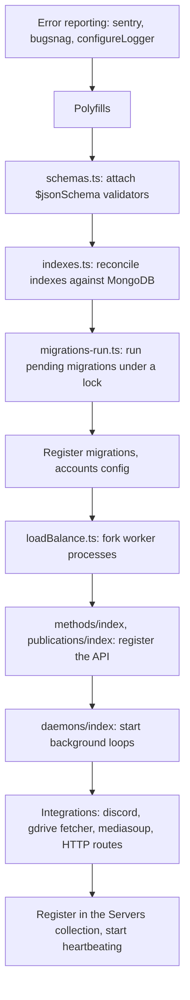

---
files:
  - server/main.ts
  - imports/server/runIfLatestBuild.ts
  - imports/server/MigrationRegistry.ts
  - imports/server/indexes.ts
  - imports/server/withLock.ts
  - imports/server/loadBalance.ts
  - imports/server/garbage-collection.ts
  - imports/server/GlobalHooks.ts
  - imports/Logger.ts
  - imports/server/configureLogger.ts
  - scripts/run_jolly_roger.sh
updated: 2026-09-19
---

# 10. Operations: startup, deploys, and debugging

## 1. Startup

`server/main.ts` is an ordered list of side-effect imports, and the order encodes a dependency
chain:



Error reporting comes first so that failures in everything after it are captured. The three
database-setup steps come next, in that order, because a migration may depend on an index, and
an index cannot be reconciled before the model is known.

All three database steps are wrapped in `runIfLatestBuild`, which matters during a deploy
(section 3).

## 2. Multi-process

Production runs more than one Node process. `$CLUSTER_WORKERS_COUNT` (`"auto"` for core count,
1 by default) drives `imports/server/loadBalance.ts`, a first-party reimplementation of the
long-dead `meteorhacks:cluster` package. `DEVELOPMENT.md` still credits that package; it is not
installed.

**This is the fact that shapes the most code.** Consequences:

- **Never keep authoritative state in a module-level variable.** It exists N times and will
  diverge. Use MongoDB.
- A user's WebSocket lands on an arbitrary process, but a resource (a mediasoup router, a
  document lock) lives on exactly one. Hence the `createdServer` / `routedServer` pattern in the
  WebRTC subsystem, and MongoDB-as-message-bus generally.
- **`Servers`** holds one heartbeat row per process, keyed by an in-memory `serverId`. A row
  that has not been updated for 120 seconds means a dead process, and triggers cleanup of
  whatever that process owned, because its `onStop` handlers will never run.
- **`withLock`** (`imports/server/withLock.ts`, backed by the `Locks` collection) is a
  cooperative distributed mutex, preemptible after 10 seconds. A MongoDB lock is used because
  MongoDB is already the only shared dependency; adding Redis for this alone was not worth it.

## 3. Rolling deploys and `runIfLatestBuild`

**The problem.** During a rolling deploy an old build and a new build are alive simultaneously
against one shared database. If both ran the database-setup hooks they would fight:

- The **old** build's `indexes.ts` would *drop* the indexes the new build added, because the
  reconciler drops anything not in its own declarations.
- The **old** build's `schemas.ts` would *replace* the new `$jsonSchema` validator with the old
  one, causing the new build's writes to be rejected.

**The mechanism.** `LatestDeploymentTimestamps` is a singleton collection (its `_id` schema is
literally `z.literal("default")`) recording the highest build timestamp ever seen. On startup
each process:

1. reads its own build timestamp from `fs.stat(process.argv[1]).mtime`;
2. reads the stored record;
3. if the stored timestamp is **strictly greater** than its own, skips all three setup hooks and
   logs a warning;
4. otherwise runs them, then bumps the record to its own timestamp plus git hash.

The comparison being *strictly* greater is deliberate: two processes of the same build both run
the hooks, which is fine because schema attachment and index reconciliation are idempotent and
migrations have their own lock.

> **Foot-gun: rollbacks are awkward and nothing warns you loudly.**
> Deploying an *older* bundle leaves the record pointing at the newer timestamp forever, so the
> rolled-back build permanently skips migrations, schema attachment and index reconciliation.
> Recovery is manual: delete or edit the `jr_latest_deployment_timestamps` document. The only
> signal is a single `Logger.warn`.

Note that the two deployment paths in the repo differ. `.github/workflows/deploy.yml` scps a
tarball to one VPS and restarts it, which is **not** a rolling deploy. The rolling story is the
CloudFormation autoscaling-group path in `cloudformation/jolly-roger.yaml`, which sets
`MinInstancesInService: 1`.

## 4. Migrations

`imports/server/MigrationRegistry.ts` is the engine; `imports/server/migrations/Migrations.ts`
is a four-line singleton; `all.ts` is the barrel; the numbered files are the migrations.

A control document in a `migrations` collection holds `{ version, locked, lockedAt }`. On
startup, a process takes the lock, runs every migration whose version exceeds the recorded one,
bumps the version, and releases. The lock is what stops two processes migrating at once.

`tests/unit/imports/server/MigrationRegistry.ts` is a 200-line unit test and the best
executable specification of the lock semantics. Read it if you need to reason about failure
cases.

Rules, repeated from [05-data-layer.md](05-data-layer.md#11-migrations) because they matter:

- **Never edit a shipped migration.** Add a new one.
- **Do not add indexes on `Model` collections via migration.** Declare them with `addIndex` in
  the model file. `imports/server/indexes.ts` reconciles and **will drop indexes it does not
  know about**, so a migration-created index disappears at the next startup. Indexes on
  `Meteor.users` are the exception, because it is not a `Model`.

## 5. Garbage collection and hooks

`imports/server/garbage-collection.ts` cleans up rows belonging to dead server processes:
presence subscribers, mediasoup state, and anything else whose owner stopped heartbeating.

`imports/server/GlobalHooks.ts` plus `imports/server/hooks/` is a small domain-event system.
A `Hookset` declares handlers for events like "puzzle created", "puzzle solved", "puzzle no
longer solved", "chat message sent". Registered hooksets include `ChatHooks`, `DiscordHooks`
and `TagCleanupHooks` (which strips `needs:` tags from solved puzzles).

Adding a reaction to a domain event means writing a new hookset and registering it in
`imports/server/GlobalHooks.ts`.

> **Foot-gun: `imports/server/hooks/Hookset.ts` documents the wrong path**, telling you to
> register in `imports/server/hooks/GlobalHooks.ts`. The file is one level up.

## 6. Logging

Winston, with **logfmt** output on the server and structured objects in the browser console.

**The house style is: constant message string, all variability in a structured fields object.**

```ts
Logger.info("Tagging puzzle", { puzzle: puzzleId, tag: tagName });
Logger.info("Creating a new tag", { hunt: huntId, name: cleanName });
```

Not `Logger.info(\`Tagging puzzle ${puzzleId}\`)`. This is followed consistently across the
repo, and it is what makes the logs searchable and aggregatable. Follow it.

Errors go in an `error` field rather than being interpolated into the message, because the
server formatter prints an `Error`'s name, message and stack from that field, and logfmt would
render an Error object uselessly.

On the client, fields are passed to `console.*` as a real object so devtools renders them
expandably, and the error is passed as a separate argument so you get a clickable stack.

## 7. Error reporting

Both **Sentry** and **Bugsnag** are wired up, on both client and server. Both are initialized
first thing in the entry points. Release tagging uses `Meteor.gitCommitHash`, which comes from
the `METEOR_GIT_COMMIT_HASH` build argument.

Severity is chosen from the error, and this is why the `Meteor.Error(4xx)` convention matters:
a `Meteor.Error` with a numeric code in the 400 range is reported at `info`, everything else at
`error`. Throwing a plain `Error` for an expected permission denial floods your error tracker;
throwing `Meteor.Error(400)` for a genuine bug buries it.

**Monti APM** (`montiapm:agent`) provides Meteor-specific performance monitoring: method and
publication timings, which is the fastest way to find a slow publication.

## 8. Debugging, in order

**In development:**

1. **Is the data in Minimongo?** Browser console: `await window.loadFacades()`, then
   `Models.Puzzles.find({}).count()`. If the document is there, it is a UI bug. If not, it is a
   publication bug. This single check resolves most confusion.
2. **Watch the wire.** Devtools, Network, WS filter. You can see every DDP message: method
   calls, subscription starts, document deltas.
3. **Check the server.** `meteor shell` gives you a REPL in the server process, with `Models`
   as a global: `await Models.Puzzles.findOneAsync({})`.
4. **Remember dev has no oplog.** Changes made outside your own session can take up to ten
   seconds to appear, because publications fall back to polling. This is not a bug.

**In production:**

1. Sentry or Bugsnag for the exception and its stack.
2. Monti APM for a slow or failing method or publication.
3. The server logs, which are logfmt and therefore greppable by field.
4. `/rtcdebug` for anything audio-related.

## 9. Environment variables

Documented in `DEVELOPMENT.md`; the ones that matter most:

| Variable | Why you care |
| --- | --- |
| `$MONGO_URL` | The database. Dev supplies its own. |
| `$MONGO_OPLOG_URL` | **Strongly recommended in production.** Without it, publications poll every ten seconds instead of tailing the oplog. Requires a replica set, size 1 is fine. |
| `$MAIL_URL` | Outbound email. Without it, Meteor logs messages to the console. |
| `$ROOT_URL` | Base URL for generated links |
| `$CLUSTER_WORKERS_COUNT` | Worker process count; `"auto"` for core count |
| `$TURN_SERVER`, `$TURN_SECRET`, `$TURN_USERNAME`, `$TURN_CREDENTIAL` | TURN relay for WebRTC across restrictive networks |

Note that **application configuration is not environment variables**. Google credentials, the
Discord bot, S3 buckets and branding all live in the `Settings` collection and are configured
through the admin setup page.

`scripts/run_jolly_roger.sh` is the production entry point: it pulls secrets from AWS SSM,
defaults `CLUSTER_WORKERS_COUNT` to `auto` on a box with more than 512 MB of RAM, and then
`exec node main.js`.
