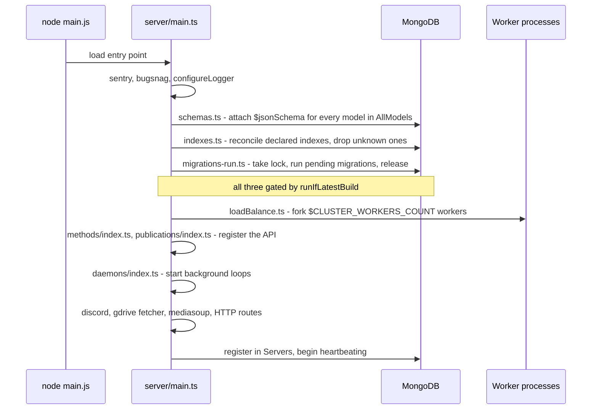
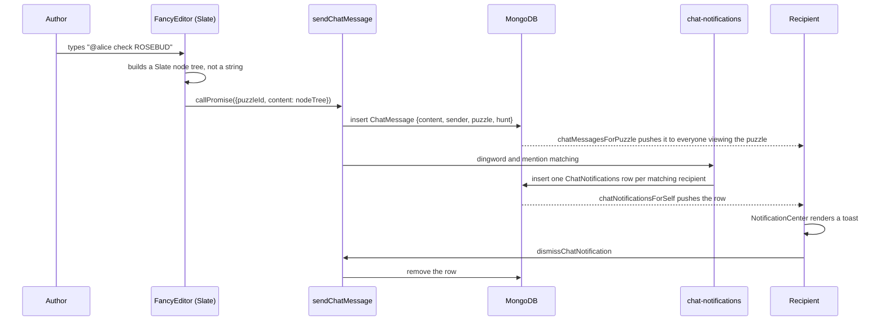

---
files:
  - server/main.ts
  - imports/server/addPuzzle.ts
  - imports/server/transitionGuess.ts
  - imports/server/subscribers.ts
  - imports/server/mediasoup-api.ts
  - imports/client/main.tsx
updated: 2026-09-19
---

# 13. End-to-end walkthroughs

Following one operation all the way through the stack is the fastest way to build a mental
model. Each walkthrough names the boundary crossings explicitly, because in a Meteor app they
are not where you expect them.

---

## 1. Server cold boot



Things worth noticing:

- **Error reporting is imported first** so that failures in everything after it are captured.
- **The three database steps are ordered**: schemas, then indexes, then migrations. A migration
  may rely on an index; an index cannot be reconciled before its model is known.
- **`runIfLatestBuild` may skip all three.** During a rolling deploy an older build must not
  fight the newer one over index and schema definitions. See
  [10-operations.md](10-operations.md#3-rolling-deploys-and-runiflatestbuild).
- **Registration is the whole point of the barrel imports.** A method not imported here does
  not exist.

---

## 2. Client boot to a rendered puzzle list

```mermaid
sequenceDiagram
    participant B as Browser
    participant S as Server (HTTP)
    participant D as Server (DDP)
    participant MM as Minimongo

    B->>S: GET /
    S-->>B: HTML shell + runtime config + JS bundle
    B->>B: client/main.ts: sentry, bugsnag, logger, polyfills
    B->>B: mount React (StrictMode > BrowserRouter > Routes)
    B->>D: open WebSocket, DDP connect
    B->>D: resume login token from localStorage
    D-->>B: logged in; push the user's own document
    B->>B: RootRedirector resolves, route matches PuzzleListPage
    B->>D: sub puzzlesForHunt {huntId}
    D->>D: authenticate, authorize, scope selector by hunt
    D-->>MM: added x N (one DDP message per puzzle)
    D-->>B: ready
    B->>B: useTracker recomputes, grouping runs, list renders
```

The user sees, in order: the HTML shell, then a loading state while the subscription fills,
then the list. The **boundary crossings** are `GET /` (plain HTTP, serving the bundle) and then
the WebSocket, over which everything else travels. There is no second HTTP request for data.

---

## 3. Creating a puzzle

This is the best single flow to read, because it touches permissions, tags, an external
service, a transaction and reactive fan-out.

```mermaid
sequenceDiagram
    participant U as Operator's browser
    participant M as Method: Puzzles.methods.create
    participant AP as addPuzzle()
    participant G as Google Drive
    participant DB as MongoDB
    participant O as Every other client

    U->>M: callPromise({huntId, title, tags, expectedAnswerCount, docType})
    M->>M: validate(): check() every argument
    M->>AP: run(): check(this.userId), then addPuzzle({userId, ...})
    AP->>DB: load hunt; 404 if missing
    AP->>DB: userMayWritePuzzlesForHunt? 401 if not
    AP->>DB: getOrCreateTagByName() per tag (creates meta-for: for group:)
    AP->>DB: opportunistic duplicate-URL check
    AP->>AP: build fullPuzzle with a manually generated _id
    AP->>G: ensureDocument() - claim a pooled doc or create one
    Note over AP,G: skipped if Google unconfigured or disable.google flag set
    AP->>DB: transaction: re-check URL, then insert the puzzle
    AP->>AP: on error, delete the document just created
    AP->>AP: run puzzle-created hooks (chat, Discord)
    M-->>U: return the new puzzle id
    DB-->>O: publication observer fires, added pushed to every subscriber
    O->>O: Minimongo updates, Tracker invalidates, list regroups and re-sorts
```

Details that repay attention:

- **The `_id` is generated by hand** (`Random.id()`) before the insert. The comment explains
  why: the Google document has to be created *before* the puzzle row exists, so that nobody can
  race in and create a document with the wrong configuration, and creating the document requires
  knowing the puzzle's ID.
- **The duplicate-URL check happens twice**: once opportunistically, to fail fast before doing
  expensive work, and once inside a MongoDB transaction with `rawCollection()`, which is where
  correctness actually lives.
- **Document creation is compensated, not rolled back.** Google Drive is not in the transaction,
  so if the insert fails the code explicitly deletes the document it just created.
- **Nobody re-fetches.** The last two steps are automatic, and are the reason the app is built
  on Meteor.

> **Dead code warning.** `imports/server/addPuzzle.ts` also contains
> `createDocumentAndInsertPuzzle`, an orphaned earlier version of this logic that is never
> called. It calls `getOrCreateTagByName` and `ensureDocument` with the wrong arity (both now
> take a leading `userId`). Do not copy it; the live path is the default export, `addPuzzle`.

---

## 4. Submitting a guess through to a solved puzzle

```mermaid
sequenceDiagram
    participant S as Solver
    participant Op as Operator
    participant M as Methods
    participant TG as transitionGuess()
    participant DB as MongoDB
    participant Hooks

    S->>M: createGuess({puzzleId, guess, direction, confidence})
    M->>DB: insert Guess {state: "pending"}
    M->>DB: post a system chat message to the puzzle
    DB-->>Op: guessesForGuessQueue pushes it into the queue, live
    Op->>M: setGuessState({guessId, state: "correct"})
    M->>M: userMayUpdateGuessesForHunt? 401 if not
    M->>TG: transitionGuess(guess, "correct")
    TG->>DB: update the guess; updatedAt/By stamped by the schema layer
    TG->>DB: $addToSet the answer onto Puzzles.answers
    TG->>Hooks: runPuzzleSolvedHooks
    Hooks->>DB: chat messages to the puzzle's metas and feeders
    Hooks->>DB: BookmarkNotification per bookmarker
    Hooks-->>Hooks: Discord announcement, if configured
    TG->>DB: system chat message recording the transition
    DB-->>S: notification arrives; puzzle list re-sorts as solvedness changes
```

- **Every state change funnels through `transitionGuess`.** If you are adding a side effect to
  guesses, that is where it goes.
- **Leaving `correct`** pulls the answer back off the puzzle and runs the no-longer-solved
  hooks. Note there is no Discord hook in that direction.
- **With `hasGuessQueue: false`** the first half does not happen: `addPuzzleAnswer` writes a
  `correct` guess directly and the same solved hooks run.
- The puzzle list re-sorting is not code anyone wrote for this flow. `computeSolvedness` changes,
  so `interestingnessOfGroup` changes, so the group moves. See
  [08-puzzle-logic.md](08-puzzle-logic.md).

---

## 5. A chat message with a dingword hit



- **The content is a tree.** Mentions are nodes carrying a user ID, so renaming a user updates
  every historical message.
- **Notifications are an outbox.** One row per recipient, inserted by the server and deleted by
  the recipient's own dismissal. This is how a user who was offline still sees it on return.
- The notification records **which** dingwords matched, so the UI can offer "stop alerting me
  about this word".

---

## 6. Presence: who is looking at this puzzle

```mermaid
sequenceDiagram
    participant C as Client
    participant P as Publication subscribers.inc
    participant DB as MongoDB
    participant GC as Garbage collector
    participant O as Other clients

    C->>P: subscribe with context {hunt, puzzle}
    P->>DB: insert a Subscribers row (server id, connection, context)
    Note over P: the publication returns NO data.<br/>Its purpose is the side effect.
    DB-->>O: presenceForHunt aggregates rows into per-puzzle counts
    C->>P: navigate away / close tab / lose connection
    P->>DB: this.onStop() deletes the row
    Note over GC,DB: if the whole process dies, onStop never runs.<br/>Servers heartbeat stops; after 120s the GC<br/>deletes rows belonging to that server id.
```

This is the clearest example of the **subscription-as-a-resource** idiom. Once you have seen
it here, the mediasoup signalling below makes sense immediately.

---

## 7. Joining the audio call

```mermaid
sequenceDiagram
    participant C as Browser
    participant FE as Front-end process
    participant DB as MongoDB
    participant SFU as SFU process (owns the worker)

    C->>FE: subscribe mediasoup:join {call = puzzleId, tab}
    FE->>DB: insert Room {call, routedServer: <an SFU>}
    FE->>DB: insert Peer {call, tab, initialPeerState}
    DB-->>SFU: observes Rooms where routedServer = me
    SFU->>SFU: create a mediasoup Router
    SFU->>DB: insert Router {routerId, rtpCapabilities}
    DB-->>C: Router published; client learns the router's capabilities
    C->>FE: subscribe mediasoup:transports {rtpCapabilities}
    FE->>DB: insert TransportRequest {routedServer}
    DB-->>SFU: observes TransportRequests
    SFU->>SFU: create send and recv WebRtcTransports
    SFU->>DB: insert Transports {ice/dtls params, turnConfig}
    DB-->>C: client builds its local transports
    C->>FE: ConnectRequest {dtlsParameters}
    DB-->>SFU: observes; calls transport.connect()
    SFU->>DB: insert ConnectAck
    DB-->>C: ack acts as mediasoup-client's connect callback
    C->>FE: ProducerClient {trackId, rtpParameters}
    DB-->>SFU: creates the Producer, inserts ProducerServer
    SFU->>DB: inserts Consumers for every other peer
    DB-->>C: other peers build local consumers, send ConsumerAcks
```

The thing to hold onto: **MongoDB is the message bus.** The browser's WebSocket is attached to
an arbitrary process, but the mediasoup worker lives on exactly one. Rather than adding Redis or
an internal RPC mesh, every signalling step is a document, and each SFU watches the documents
addressed to it via `routedServer`. Teardown rides on `this.onStop()`, exactly as in the
presence flow above.

---

## 8. A change from your editor to production

```mermaid
sequenceDiagram
    participant Dev as Your editor
    participant Local as meteor run
    participant CI as GitHub Actions
    participant Prod as Production

    Dev->>Local: save a file
    Local->>Local: rebuild; hot code push to open browsers
    Note over Local: useBlockUpdate can DEFER the reload<br/>if the user is mid-sentence
    Dev->>CI: open a pull request
    CI->>CI: build.yml: docker test stage runs `npm run lint` then `npm test`
    CI->>CI: build amd64 + arm64 production images in parallel
    Dev->>CI: merge to main
    CI->>Prod: deploy.yml: meteor build, scp the tarball, restart
    Prod->>Prod: new process boots; runIfLatestBuild compares build mtime
    Prod->>Prod: newest build attaches schemas, reconciles indexes, runs migrations
    Prod->>Prod: older processes skip all three
    Prod-->>Dev: connected browsers are told to reload
```

Two things to remember from this diagram:

- **`npm run lint` gates the merge**, and it includes the docs freshness check. Editing a file
  listed in a `docs/*.md` front matter without touching that doc fails CI.
- **A rollback leaves `LatestDeploymentTimestamps` pointing at the newer build**, so the
  rolled-back code permanently skips migrations and schema work until someone edits that
  document by hand.
